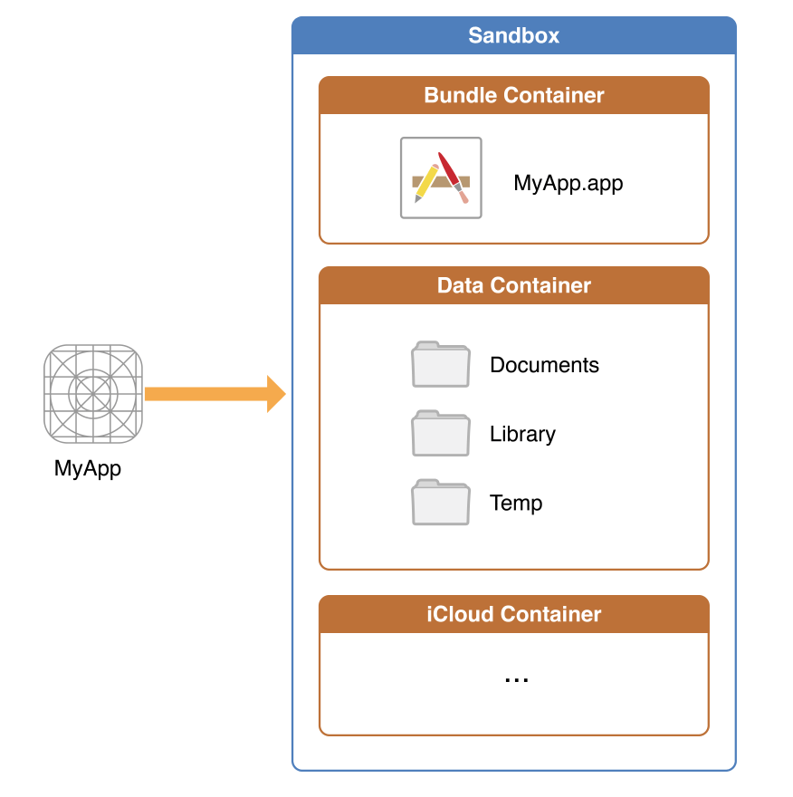

# ReactNative android download share demo

This is an example for how to download and share file in Android with React Native.

## How to run

You can install with npm:

```bash
npm install
```

or install with yarn

```bash
yarn install
```

Then

```bash
react-native link
react-native run-android
```
## `RNFetchBlob.fs.dirs.DocumentDir` is different in Android and iOS

`RNFetchBlob.fs.dirs.DocumentDir` will return current Document path for Apps.

But in Android, it returns path: `/data/data/packagename`, which is an internal storage that can not be retrieved by other APPs.

However in iOS, it returns: `Users/username/Library/Developer/CoreSimulator/Devices/CB5710EB-5AF2-49C4-9551-ABB8BA22381E/data/Containers/Data/Application/48158C43-4692-4B27-BC0F-9F6DDE158F6F/Document`, which is in the Data Container of iOS sandbox:



From [official document](https://developer.apple.com/library/content/documentation/FileManagement/Conceptual/FileSystemProgrammingGuide/FileSystemOverview/FileSystemOverview.html) we can know that the iOS Document folder:

>Use this directory to store user-generated content. The contents of this directory can be made available to the user through file sharing; therefore, his directory should only contain files that you may wish to expose to the user.
The contents of this directory are backed up by iTunes and iCloud.

So we can share file from location `RNFetchBlob.fs.dirsDocumentDir` in iOS, but for Android, we should use some external storage paths for that.

## What's more

For more information, please see [my blog](http://hanpanpan200.github.io/2017/02/08/react-native-android-share/)
